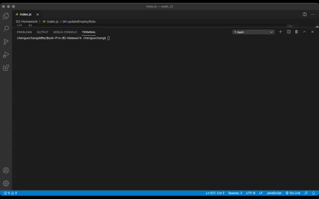

<h1 align="center">Employee_management_system</h1>

<br />

## Description 
This Node application is for a business owner to be able to view and manage departments, roles, and employees in their company in order to organize and plan their business. <br />
<br/>
This application gives you the following options:<br/>
 * 1.View all employees by department and manager.<br/>
 * 2.Add employee, department and role.<br/>
 * 3.Update employee's role. <br/>
 * 4.Delete employee, role and department.<br/>
<br/>
Below is the video demo showing the functionality of the application:<br />
  


## Table of Contents

- [Description](#description)
- [Installation](#installation)
- [Usage](#usage)
- [License](#license)
- [Contribution](#contributing)
- [Tests](#tests)
- [Questions](#questions)

## Installation
Clone the repository to your local development environment.
```
git clone https://github.com/GaryChen513/Employee_management_system.git
run npm install to install dependencies.
run schema.sql and seeds.sql to generate database in MySQLWorkBench
```


## Usage
Manage employees with CLI.<br/>

## License
<br />
This application is covered by the MIT license.

## Contributing
[Gary Chen](https://github.com/GaryChen513)

## Tests
no

## Questions
Contact me with any question: [Github](https://github.com/GaryChen513), 
[Email](mailto:garychen19970513@gmail.com)
